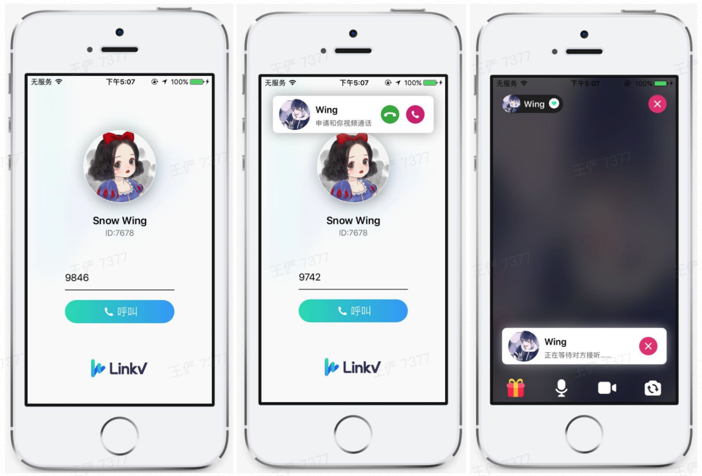
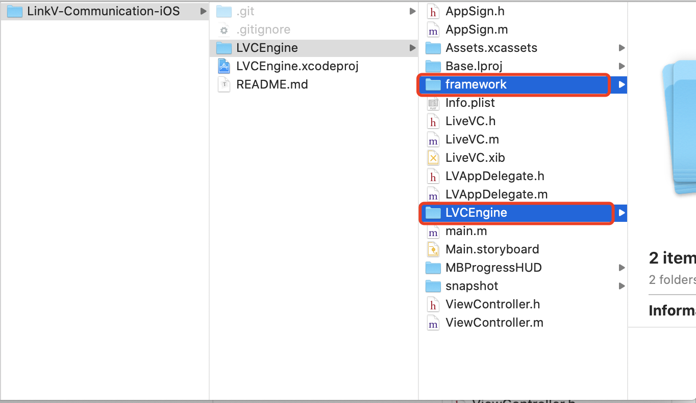
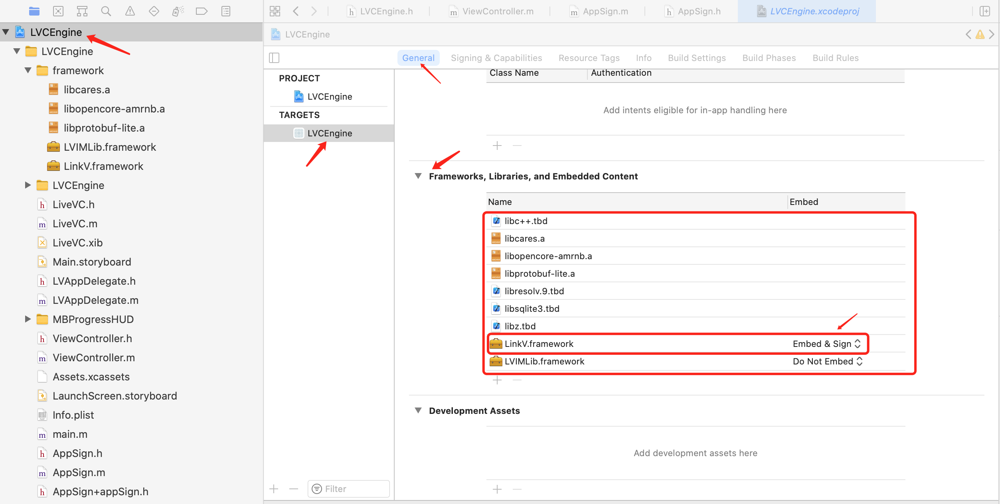

# LinkV-Communication

- 商务合作与技术交流请加QQ群：**1160896626**，邮箱：**develop@linkv.sg**

此SDK主要是对[LinkV音视频SDK](https://doc-zh.linkv.sg/ios/rtc/overview)和[IM SDK](https://doc-zh.linkv.sg/ios/im/overview)的一层封装，使其接口更加简单易用。所有封装的代码都在`LVCEngine`文件夹下，且全部开源，您可以根据您的需求任意修改里面的代码实现。当然您也可以在项目中直接引用[LinkV音视频SDK](https://doc-zh.linkv.sg/ios/rtc/overview)和[IM SDK](https://doc-zh.linkv.sg/ios/im/overview)相关的类来实现更加复杂的功能。

如果你想要实现类似如下的一对一视频聊天，则使用此SDK能让你事半功倍。一对一视频聊天Demo源码：[StrangerChat](https://github.com/linkv-io/StrangerChat)



# 一、如何集成

## 1.1 环境准备

* iOS 9.0 或更高版本。
* Xcode 10.0 或以上版本。

## 1.2 集成SDK
### 1.2.1 Cocoapods集成

> 在执行以下步骤之前，请确保已安装 `CocoaPods`。 请参阅 [*CocoaPods 官网*](https://cocoapods.org/)

在工程 `Podfile` 文件中添加`LinkV-Communication`依赖，然后执行 `pod install` 即可添加此SDK到工程中（如果搜索不到可以在终端执行`pod repo update` 更新索引库）

```
pod 'LinkV-Communication'
```

###  1.2.2 手动集成
#### (1)下载SDK
把整个项目从[github](https://github.com/linkv-io/LinkV-Communication-iOS)下载下来之后，把`framework`和`LVCEngine`拖入到你的项目中



在`Frameworks,Libraries, and Embedded Content`中设置LinkV.framework为`Embed & Sign`，并且添加需要的系统库：`libc++.tbd`、`libresolv.9.tbd`、`libsqlite3.tbd`、`libz.tbd`



#### (2)关闭bitcode

> 由于 **SDK** 目前没有支持 `bitcode`，所以需要关闭 bitcode 选项。

`TARGETS` → `Build Settings` 搜索 `bitcode` ，将`Enable Bitcode`设置为 **NO**


## 1.3 添加权限和关闭ATS

> SDK 依赖了摄像头、麦克风等相关权限，需要 APP 主客户端info.plist中添加相关权限的描述。
>
> 由于目前 SDK 还需要使用 http 域名，所以需要关闭 ATS。

选择项目 → `Info.plist` → 右键点击 Info.plist →  Open As →  `Source Code` 复制以下内容到 Info.plist 里面。

```xml
<!-- 麦克风和摄像头权限申请   -->
<key>NSCameraUsageDescription</key>
<string>LinkliveSDK 需要使用摄像头权限，否则无法发布视频直播</string>
<key>NSMicrophoneUsageDescription</key>
<string>LinkliveSDK 需要使用麦克风权限，否则无法发布音频直播</string>
  
<!-- 关闭ATS -->
<key>NSAppTransportSecurity</key>
<dict>
    <key>NSAllowsArbitraryLoads</key>
    <true/>
</dict>
```

# 二、 如何使用LVCEngine

## 前提条件

首先需要在 [开发者平台](https://dev.linkv.sg/) 注册账号，创建应用，然后获取 **SDK** 鉴权需要的 `appID` 和 `appSecret` ，在实现直播之前，请确认您已完成以下操作：

* [创建应用、获取 appID 和 appSecret](https://doc-zh.linkv.sg/platform/info/quick_start)
* 已集成SDK

## 2.1 初始化SDK

```objective-c
self.engine = [LVCEngine createEngineWithAppId:[AppSign your_app_id] appKey:[AppSign your_app_key] completion:^(NSInteger code) {
        if (code == 0) {
          // 认证成功
        } else {
          // 认证失败
        }
    }];
```

## 2.2 登录SDK

```objective-c
[self.engine loginIM:self.uid delegate:self];
```

并实现以下IM回调

```objective-c
// 查询token事件,你需要通过server to server方式获取IM的token，然后再调用setIMToken方法将token设置给SDK
// SDK会向IM服务器进行校验，如果认证成功则调用onIMAuthSucceed方法，失败则调用onIMAuthFailed
// 使用过程中如果发现token过期会调用onIMTokenExpired
// 在token认证成功之前此方法会被SDK频繁调用
-(void)onQueryIMToken {}
// 认证成功
-(void)onIMAuthSuccessed:(NSString*)uid token:(NSString*)token unReadMsgSize:(int)unReadMsgSize {}
// 认证失败
-(void)onIMAuthFailed:(NSString*)uid token:(NSString*)token ecode:(int)ecode rcode:(int)rcode expired:(BOOL)expired {}
// 认证过期
-(void)onIMTokenExpired:(NSString*)uid token:(NSString*)token owner:(NSString*)owner {}
```

## 2.3 设置IM事件监听

> 建议在初始化**sdk**时设置全局消息代理，如不设置，私信消息和房间消息都将无法收到。

```
[self.engine setIMGlobalReceiveMessageDelegate:self];
```

并实现代理

```objective-c
// 返回YES代表忽略这条消息
// 返回NO代表这条消息需要处理
- (BOOL)onIMReceiveMessageFilter:(int32_t)diytype fromid:(const char *)fromid toid:(const char *)toid msgtype:(const char *)msgtype content:(const char *)content waitings:(int)waitings packetSize:(int)packetSize waitLength:(int)waitLength bufferSize:(int)bufferSize {
    return NO;
}

// 收到一条消息
- (int)onIMReceiveMessageHandler:(NSString *)owner immsg:(LVIMMessage *)immsg waitings:(int)waitings packetSize:(int)packetSize waitLength:(int)waitLength bufferSize:(int)bufferSize {
    return 0;
}
```

## 2.4 发送私信

`私信:`即点对点IM消息，发送给指定userId的用户

```objective-c
[self.engine sendPrivateMessage:0 tid:user_id type:msg_type content:content complete:^(int ecode, int rcode, int64_t lvsgid, int64_t smsgid, int64_t stime, LVIMMessage *msg) {
        if (ecode == 0) {
          // 发送消息成功
        } else {
          // 发送消息失败
        }
    }];
```

# 三、使用LVCEngine实现直播间功能

## 3.1 登录房间

```objective-c
[self.engine loginRoom:self.uid roomId:self.roomId isHost:self.isHost delegate:self];
```

并实现代理

```objective-c
// 有人开始往房间推流
// 在此回调中开始拉取对应uid的视频流
- (void)onAddRemoterUser:(NSString *)uid {
    // if ([uid isEqualToString:self.uid]) return;
    // [self.engine startPlayingStream:uid inView:self.otherView];
}

// 他人停止推流
// 在此回调中停止拉取对应uid的视频流
- (void)onRemoteLeave:(NSString *)uid {
    // [self.engine stopPlayingStream:uid];
}

// 断开连接
- (void)onRoomDisconnect:(int)errorCode roomId:(NSString *)roomId {}

// 进入房间成功
// 在这个回调里添加自己的【预览视图】和【推流】
- (void)onRoomConnected:(NSString *)roomId {
    // [self.engine startPreview:self.meView];
    // [self.engine startPublishing];
}

// 视频尺寸发生变化
- (void)onVideoSizeChanged:(NSString *)uid width:(int)width height:(int)height {}

// 推流视频质量更新
- (void)onPublishStreamQualityUpdate:(NSString *)uid quality:(VideoQuality *)quality {}

// 拉流视频质量更新
- (void)onRemoteQualityUpdate:(NSString *)uid quality:(VideoQuality *)quality {}

// 收到房间消息
- (int)onRoomMessageReceive:(LVIMMessage *)msg {
    return 0;
}

// 收到首帧音频流
- (void)OnReceivedFirstAudioFrame:(NSString *)userId streamId:(NSString *)streamId {}

// 收到首帧视频流
- (void)OnReceivedFirstVideoFrame:(NSString *)userId streamId:(NSString *)streamId
```

## 3.2 添加预览视图并往服务器推流

在**登录房间成功的回调**里`添加预览视图`和`推流`

```objective-c
- (void)onRoomConnected:(NSString *)roomId {
    [self.engine startPreview:self.meView];
    [self.engine startPublishing];
}
```

## 3.3 拉取房间中其他人的视频流

在`onAddRemoterUser:`这个回调中拉取他人的视频流

```objective-c
- (void)onAddRemoterUser:(NSString *)uid {
  	if ([uid isEqualToString:self.uid]) return;
    [self.engine startPlayingStream:uid inView:self.otherView];
}
```

## 3.4 停止拉取房间中其他人的视频流

在`onRemoteLeave:`中停止拉取对应uid的视频流

```objective-c
- (void)onRemoteLeave:(NSString *)uid {
    [self.engine stopPlayingStream:uid];
}
```

## 3.5 房间消息

发送房间消息，房间中的所有人都会收到消息回调

```objective-c
[self.engine sendRoomMessage:self.roomId content:@"Your_Content" complete:^(int ecode, int rcode, int64_t lvsgid, int64_t smsgid, int64_t stime, LVIMMessage *msg) {
        if (ecode == 0) {
          // 发送消息成功
        } else {
          // 发送消息失败
        }
    }];
```

收到房间消息回调

```objective-c
- (int)onRoomMessageReceive:(LVIMMessage *)msg {
    return 0;
}
```

## 3.6 录制视频

开始录制视频

```objective-c
/// @param userId 用户 ID
/// @param path 文件路径
/// @param type 音视频录制类型
/// @return 0 : 录制成功， 其他 : 录制失败
- (int)startRecorder:(NSString *_Nonnull)userId path:(NSString *_Nonnull)path type:(LVRecorderType)type;
```

停止视频录制

```objective-c
/// 停止录制
/// @param userId 音视频用户 ID
/// @return 0 : 停止录制成功，其他 : 停止录制失败
- (int)stopRecorder:(NSString *_Nonnull)userId;
```

## 3.7 音视频首帧回调

```objective-c
/// 收到【视频】首帧回调通知事件
/// @param userId 视频发送者用户 ID
/// @param streamId 流 ID，默认为空字符串，如果使用自定义视频流时为自定义视频流对应的流名称
- (void)OnReceivedFirstVideoFrame:(NSString *_Nullable)userId streamId:(NSString *_Nullable)streamId {}


/// 收到【音频】首帧回调通知事件
/// @param userId 视频发送者用户 ID
/// @param streamId 流 ID，默认为空字符串，如果使用自定义视频流时为自定义视频流对应的流名称
- (void)OnReceivedFirstAudioFrame:(NSString *_Nullable)userId streamId:(NSString *_Nullable)streamId {}
```

## 3.8 退出房间

```objective-c
[self.engine logoutRoom];
```

